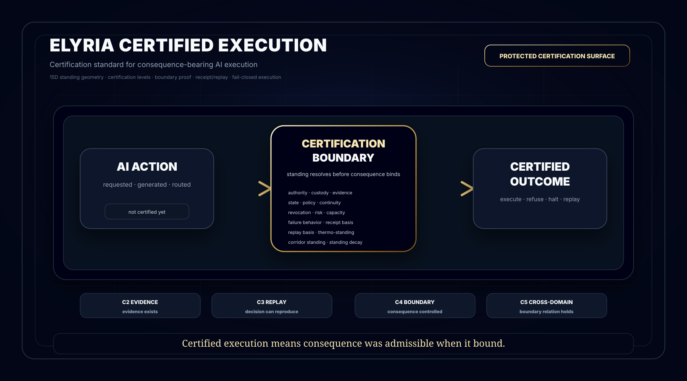

# Elyria Certified Execution


Built by **Elyria Systems — VA**.

Copyright (c) 2026 **Samantha Revita** and **Terry Snyder**. All rights reserved.

This repository is a **protected public proof surface**. It is **not open source**.



## What this is

Elyria Certified Execution is a public-safe certification surface for consequence-bearing AI execution.

It defines the public distinction between an AI action that appears valid and an AI action that is certified to bind consequence under current standing.

The point is not whether a system generated, routed, approved, or logged an action.

The point is whether that action had standing when consequence became real.

## Core claim

```text
Certified execution means consequence was admissible when it bound.
```

A system can be:

```text
authenticated
policy-aligned
workflow-complete
semantically coherent
technically executable
```

and still fail certified execution if current standing does not hold.

## Public 15D standing geometry

This repository uses **15D standing geometry** as a public category marker for certification.

It names the visible dimensions used to evaluate consequence-bearing standing without exposing private runtime law, production thresholds, protected evaluator logic, customer corridors, private schemas, or deployment-sensitive machinery.

```text
authority · custody · evidence · state · policy
continuity · revocation · risk · capacity · failure behavior
receipt basis · replay basis · thermo-standing · corridor standing · standing decay
```

Public rule:

```text
Show the geometry.
Do not disclose the machinery.
```

## Certification relation

```text
C2 proves evidence exists.
C3 proves evidence can replay.
C4 proves consequence is controlled before binding.
C5 proves the boundary relation itself remains admissible across domains.
```

This is a public-safe certification ladder, not a disclosure of private certification methodology.

## Boundary rule

```text
No consequence-bearing AI action is certified unless standing resolves before consequence binds.
```

Only an admitted action may bind consequence.

If standing is incomplete, stale, revoked, non-replayable, overburdened, outside corridor, or unsupported by current state, the consequence is not certified.

## Outcome grammar

```text
EXECUTE
REFUSE
ESCALATE
HALT
QUARANTINE
REVOKE
```

Only `EXECUTE` may support certified consequence binding.

All other outcomes fail closed and preserve receipt/replay evidence.

## What this is not

This is not:

```text
a dashboard
a compliance checklist
a generic AI governance label
a monitoring layer
a post-event audit tool
a trust badge without enforcement basis
```

Those surfaces may provide evidence, but they do not certify consequence-bearing execution by themselves.

## Protected boundary

This repository intentionally excludes:

```text
private runtime law
protected enforcement internals
customer-specific corridors
customer policies
production adapters
private evaluator algorithms
private schemas
receipt-generation internals
replay-verification internals
protected runtime substrate
commercial certification reports
deployment-sensitive architecture
```

## Category statement

Elyria Certified Execution defines a public-safe certification surface for consequence-bearing AI execution.

Standing is geometry, not permission.

Certification is replayable proof that consequence was admissible across the governing geometry when it bound.
