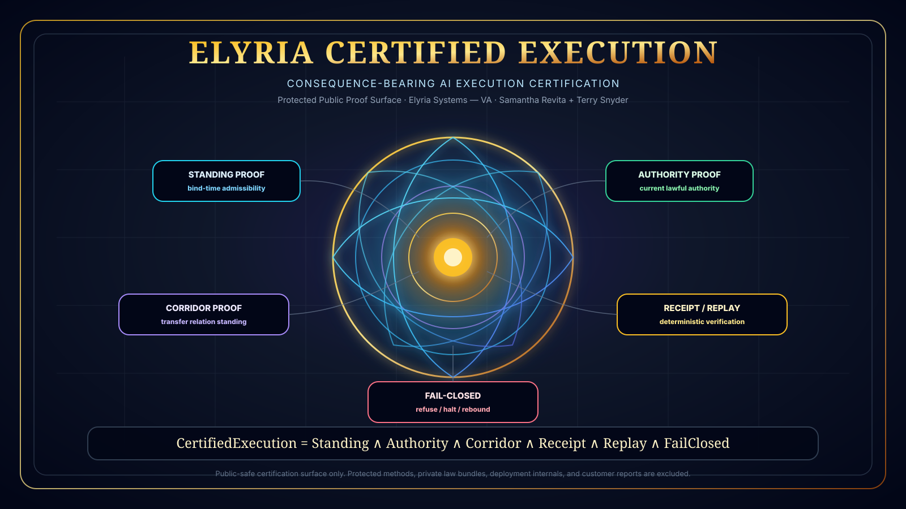

# Elyria Certified Execution


[](https://github.com/Kamanaka5502/elyria-certified-execution/actions/workflows/proof.yml)

Built by **Elyria Systems — VA**.

Copyright (c) 2026 **Samantha Revita** and **Terry Snyder**. All rights reserved.

This repository is a **protected public proof surface**. It is **not open source**.



## What this is

Elyria Certified Execution is a public certification standard for consequence-bearing AI execution.

It defines what must be proven before an AI action, agent action, tool call, transfer, recommendation, or automated consequence can be treated as governed execution.

It is not a compliance checklist, dashboard, post-event audit log, risk score, or policy wrapper.

It certifies whether consequence-bearing execution is:

```text
admitted
bounded
receipt-bearing
replay-verifiable
fail-closed
admissible at the boundary where it binds
```

## Runnable public proof

The first admitted executable surface is a public-safe C5 cross-boundary certification validator.

Run:

```bash
python certify.py examples/c5_cross_boundary_receipt.json
python certify.py examples/c5_cross_boundary_receipt.json --compact
python test_certify.py
```

Expected certification level:

```text
C5 — Cross-Boundary Certified Execution
```

## Core rule

A system is not certified because it has policies, logs, controls, or approvals.

A system is certified only if consequence-bearing actions are admitted, bounded, receipt-bearing, replayable, and fail-closed at the boundary where they bind.

## Certification formula

```text
CertifiedExecution =
  BoundaryStanding
  AND AuthorityProof
  AND CorridorProof
  AND ReceiptIntegrity
  AND ReplayVerification
  AND FailClosedBehavior
```

## Certification levels

```text
C0 — Claim Only
System asserts governance but provides no enforceable proof.

C1 — Logged Execution
System records actions after they occur.

C2 — Receipt-Bearing Execution
System emits structured receipts for decisions/actions.

C3 — Replay-Verifiable Execution
Receipts can be replayed under the same state/law/input conditions.

C4 — Boundary-Enforced Execution
Actions are admitted or refused before consequence binds.

C5 — Cross-Boundary Certified Execution
Execution remains admissible across organizations, agents, data corridors, authority domains, and transfer relations.
```

## Proof requirements

```text
1. Standing Proof
The proposed consequence had standing at bind-time.

2. Authority Proof
The actor, system, or agent had valid current authority.

3. Corridor Proof
If consequence crossed a boundary, the transfer relation itself had standing.

4. Receipt + Replay Proof
The decision produced deterministic evidence that can be replayed.

5. Fail-Closed Proof
When standing failed, the system narrowed, escalated, refused, halted, quarantined, or rebounded.
```

## Related public surfaces

```text
Elyria-Q Standing Diagnostics
Corridor Standing Physics
LLM Coherence Control Plane
Agentic Chip Benchmark
```

## Protection boundary

This repository intentionally excludes:

```text
private runtime law
protected enforcement internals
private certification methodology
customer-specific certification reports
private law bundles
production deployment architecture
NDA-bound formal proofs
commercial pilot terms
private Veritas Aegis lineage materials
internal Elyria Systems — VA architecture
```

## License posture

```text
Owner: Samantha Revita + Terry Snyder
System: Elyria Systems — VA
License posture: All rights reserved / protected public proof surface
Open-source status: Not open source
Production use: Not authorized without written agreement
Commercial use: Not authorized without written agreement
Derivative use: Not authorized without written agreement
```

## Category statement

Elyria Certified Execution is a protected public proof surface for certification of consequence-bearing AI execution across standing, authority, corridor integrity, receipt/replay, and fail-closed control at the boundary where actions bind.
